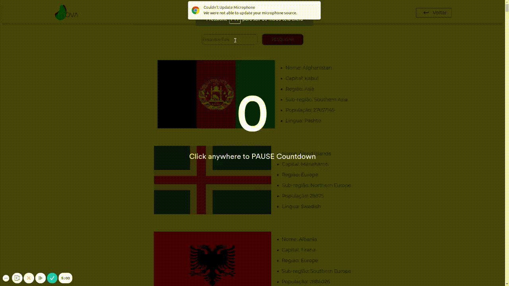

<div align="center">

<h3>

Projeto realizado com **HTML**, **CSS**, **JAVASCRIPT** e **VueJS**. 

</h3>
<br>

  

</div>

<br>

## 📚 **Sobre**

Aplicação de listagem e caracterização de países a partir da integração com a API Rest Countries.

<br>

### 📌  **Tecnologias utilizadas**
- Vue
- Npm
- Axios
- Api Rest Countries

<br>


### 🚀 **Mão na massa**

```bash
# Clone este repositório
$ git clone https://github.com/Joao-Augusto-Oliveira/movacountries

# Acesse a pasta do projeto no terminal/cmd
$ cd movacountries

# Instale as dependências
$ npm install

# Execute a aplicação em modo de desenvolvimento
$ npm run serve


```

<br>
<br>

<h3 align="center">
Feito com 💜 por <a href="https://www.linkedin.com/in/joão-augusto-oliveira-dos-santos-9b0693195">João Augusto</a>
<br><br>
 
</a>
</h3>

<!-- Links -->


